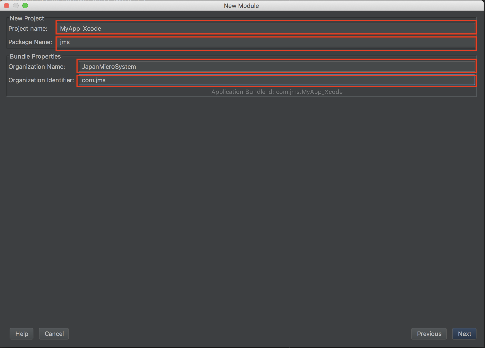

#Android Studio 開発

## Projectの作成
1. Android Studioを起動、スタートメニューより
	`Start a new Android Studio project`
	を選択。
	
	
	
1. アプリケショーン名`Application name`

	ドメイン名`Company domain`
	
	パッケージ名`Package name`
	
	を入力し、C++またはkotlinでの開発を行う場合は開発言語にチェックを入れる。
	
	Java開発の際にはチェック不要
	
	

1. `Phone and Tablet`にチェックを入れ、サポートするOSバージョンの最低値を選択。

	

1. アプリケーションの画面テンプレートを選択。

	

	
1. Main画面(以降:**MainActivity**)及びMainActivityのLayoutファイルの名前を設定。 

	

1. Finishを押すとProjectが作成され、GradleがBuildされる。

## iOS用Moduleの作成

1. Moduleを追加するProject上で

	`File` -> `New` -> `Multi-OS Engine Module`
	
	
	
	または
	
	Projectルートで右クリック `New` -> `Multi-OS Engine Module`を開く
	
	
	
	
1. `Multi-OS Engine`のタブよりJavaまたはKotlinのApplicationスタイルを選択して`Next`

	Applicationスタイルの詳細については[Xcode開発]()参照
	
	
	
	
1. XcodeProject名`Project name`
	
	パッケージ名`Package name`
	
	会社名:`Organization Name`
	
	アプリID:`Organization Identifier`
	
	を入力し、`Next`
	
	

1. Android StudioでのiOS Module名`Module name`

	Gradleのディレクトリ`Contents root`
	
	Moduleのディレクトリ`Module file location`
	
	を選択し、`Finish`

	

1. iOS Moduleが作成され、Gradleの同期を要求されるので

	`Sync Now`を押し、同期を実行する。
	
	
	

## 共通Moduleの作成と追加
	
1. `File` -> `New` -> `Module`

	
	
	または
	
	Projectルートで右クリック -> `New` -> `Module`
	
	
	
	を開く
	
1. `Java Library`を選択

	
	
1. Module名`Library name`

	パッケージ名`Java package name`
	
	Class名`Java class name`
	
	を入力し、`Finish`		

	
	

1. Java Library Moduleが作成され、Gradleの同期を求められるので`Sync Now`で同期を行う。

	kotlinを使用する場合には
	
	作成したjava libraryのbuild.gradleに
	
	``` build.gradle
	
		dependencies {
        		implementation fileTree(dir: 'libs', include: ['*.jar'])

        	/**
         	*  Kotlinを使用するため
         	*  kotlin　standard libraryを導入する。
         	*/
        	// kotlin libraryの最新バージョン
        	ext.kotlin_version = '1.2.10'
        	implementation"org.jetbrains.kotlin:kotlin-stdlib-jre7:$kotlin_version"
        }
		
	```
	
	を記述し、同期する。
	
	
1. Moduleをアプリに追加する。

	Projectルートで右クリック`Open Module Setting`を選択
	
	
	

1. 追加したいアプリのModuleを選択し、`Dependancies`タブを選択

	左下の`+`ボタンより`3 Module dependency`を選択し
	
	追加するModuleを選択する。
	
	
	
	
	

1. 以上でAndroidStudioのProjectの作成方法は終了です。


## 終わりに

- 本社1号棟1階のプリンタの下に野口個人所有のAndroid開発参考書があるので合わせてご確認ください。
	
