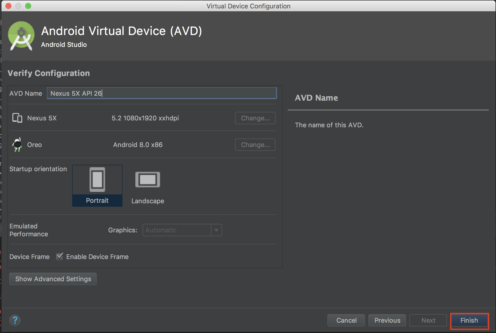

# Androidアプリのビルド

## ビルドアプリを選択

- 下記の画像の様にアプリのタブボックスの`▼`からBuildするアプリを選択。

	- Androidなら`app`
	- iosなら`ios`

## Debugの実行

- ツールバーの`Run`より`Debug アプリ名を選択。

## Launch Hardwareの選択

- アプリをインストールするデバイスを選択する。
- 新しくSimulatorを作成する場合は`Create New Virtual Device`を選択。

- 機種の選択

- OSの選択

- デバイスの詳細設定
	メモリ割当等の設定なので基本的にはそのままで大丈夫です。

- ビルド画面で作成したSimulatorを選択し`OK`を押すとSimulatorの起動とアプリのインストールが開始されます。
